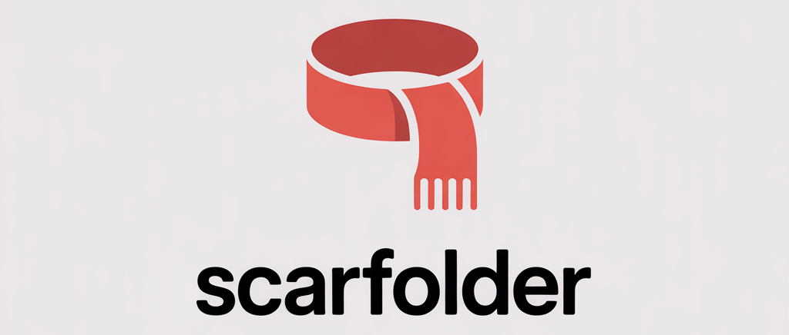

<div align="center">
  
  <br/>
  <br/>
  <p>
    <strong>Data and file scaffolding via configurable YAML pipelines.</strong>
  </p>
  <p>
    Define generators, transformers, and loaders — wire them together in YAML — run anywhere.
  </p>
  <br/>
</div>

---

## Table of Contents

- [Concepts](#concepts)
- [Installation](#installation)
- [Quick Start](#quick-start)
- [Pipeline Configuration](#pipeline-configuration)
  - [Structure](#structure)
  - [Args & Placeholders](#args--placeholders)
  - [External Refs](#external-refs)
- [CLI Reference](#cli-reference)
- [Built-in Plugins](#built-in-plugins)
- [Writing Custom Plugins](#writing-custom-plugins)
- [Running with Docker](#running-with-docker)

---

## Concepts

A **Scarf** is a full pipeline defined in a single `.yaml` file. It contains one or more **Steps**, each composed of up to three plugins executed in sequence:

```
Generator  ──▶  Transformer  ──▶  Loader
(required)      (optional)        (optional)
```

| Plugin | Role |
|---|---|
| **Generator** | Produces a list of values |
| **Transformer** | Transforms the list into a new list |
| **Loader** | Consumes the list — writes files, runs queries, etc. |

Each step can be given an `id` so its output can be referenced by downstream steps using `${steps.id}`.

---

## Installation

**Requirements:** Python 3.11+

```bash
# Clone and install in a virtual environment
git clone <repo-url> scarfolder-py
cd scarfolder-py

python3.11 -m venv .venv
source .venv/bin/activate      # Windows: .venv\Scripts\activate

pip install -e .               # add [dev] for pytest
```

The `scarfolder` command is now available in your shell.

---

## Quick Start

```bash
# Run the included hello-world example
scarfolder run examples/hello_world/scarf.yaml

# Override a config arg at runtime
scarfolder run examples/hello_world/scarf.yaml -pcount=10 -poutput=out.txt

# Check a config file without running it
scarfolder validate examples/hello_world/scarf.yaml

# Inspect the steps of a pipeline
scarfolder list-steps examples/hello_world/scarf.yaml
```

---

## Pipeline Configuration

### Structure

```yaml
name: my-pipeline
description: Optional description

# (optional) External YAML files accessible via ${ref_name.key}
refs:
  queries: ./sql/queries.yaml

# Default argument values.
# Set a value to null to mark it as required — the CLI will prompt for it.
args:
  language: en
  count: 10
  output: null       # required — must be supplied via -p or interactive prompt

steps:
  - id: names                       # optional; required if referenced downstream
    generator:
      name: my_pkg.generators.Name
      args:
        language: ${args.language}
        count: ${args.count}
    transformer: my_pkg.transformers.capitalize   # short form (no args)

  - generator:
      name: scarfolder.generators.util.From
      args:
        stream: ${steps.names}      # reference a previous step's output
    loader:
      name: scarfolder.loaders.file.WriteLines
      args:
        path: ${args.output}
```

### Args & Placeholders

Placeholders use `${namespace.key}` syntax and are resolved before each step runs.

| Placeholder | Resolves to |
|---|---|
| `${args.key}` | A runtime argument (CLI or config default) |
| `${key}` | Shorthand for `${args.key}` |
| `${steps.id}` | The output list of a previously executed step |
| `${refname.key}` | A value from an external YAML file (see `refs:`) |

**Type preservation:** a value that is *entirely* a placeholder (e.g. `${steps.names}`) receives the actual Python object — not its string representation. This allows passing lists between steps.

**Required args** are declared with a `null` default. If not provided via `-p`, the CLI prompts interactively:

```
  Required argument 'output':
```

### External Refs

Load external YAML files and reference their contents anywhere in the config:

```yaml
refs:
  queries: ./sql/queries.yaml   # loaded from a path relative to the scarf file

steps:
  - generator: ...
    transformer:
      name: my_pkg.transformers.SqlQuery
      args:
        query: ${queries.insert_person}   # key inside queries.yaml
```

---

## CLI Reference

```
scarfolder [OPTIONS] COMMAND [ARGS]
```

### `run`

Execute a pipeline.

```bash
scarfolder run SCARF_FILE [OPTIONS]

Options:
  -p, --param KEY=VALUE   Override or supply a config arg. Repeatable.
  --dry-run               Validate config without executing any steps.
```

Examples:

```bash
scarfolder run pipeline.yaml
scarfolder run pipeline.yaml -planguage=it -pcount=50
scarfolder run pipeline.yaml --dry-run
```

### `validate`

Parse and validate a scarf file without running it.

```bash
scarfolder validate SCARF_FILE
```

### `list-steps`

Print a summary of all steps and their plugins.

```bash
scarfolder list-steps SCARF_FILE
```

---

## Built-in Plugins

### Generators

| Path | Description |
|---|---|
| `scarfolder.generators.util.Constant` | Repeat a single value `count` times |
| `scarfolder.generators.util.Range` | Integer sequence (`start`, `stop`, `step`) |
| `scarfolder.generators.util.From` | Pass an existing step output through unchanged |
| `scarfolder.generators.util.Combine` | Zip multiple streams into tuples |
| `scarfolder.generators.util.Enumerate` | Pair each item with its index |

### Transformers

| Path | Description |
|---|---|
| `scarfolder.transformers.text.capitalize_first` | Capitalise first letter of each string |
| `scarfolder.transformers.text.upper` | Upper-case every string |
| `scarfolder.transformers.text.lower` | Lower-case every string |
| `scarfolder.transformers.text.strip` | Strip leading/trailing whitespace |
| `scarfolder.transformers.text.join` | Join each inner sequence into a string |
| `scarfolder.transformers.text.prefix` | Prepend a fixed string |
| `scarfolder.transformers.text.suffix` | Append a fixed string |
| `scarfolder.transformers.text.format_template` | Apply `{value}` format template |

### Loaders

| Path | Description |
|---|---|
| `scarfolder.loaders.file.WriteLines` | Write one value per line to a text file |
| `scarfolder.loaders.file.WriteJson` | Serialise values as a JSON array |
| `scarfolder.loaders.file.print_values` | Print values to stdout (debugging) |

---

## Writing Custom Plugins

Any Python class or plain callable can be a plugin — just reference it by its fully qualified dotted path.

### Class-based (recommended for stateful plugins)

```python
# my_project/generators.py
from scarfolder.core.base import Generator

class Name(Generator):
    def __init__(self, language: str = "en", count: int = 5):
        self.pool = ["Alice", "Bob"] if language == "en" else ["Luca", "Sofia"]
        self.count = count

    def generate(self) -> list[str]:
        import random
        return [random.choice(self.pool) for _ in range(self.count)]
```

```python
# my_project/loaders.py
from scarfolder.core.base import Loader

class WriteCsv(Loader):
    def __init__(self, path: str):
        self.path = path

    def load(self, values: list) -> None:
        import csv, pathlib
        pathlib.Path(self.path).parent.mkdir(parents=True, exist_ok=True)
        with open(self.path, "w", newline="") as f:
            csv.writer(f).writerows([[v] for v in values])
```

### Function-based (simpler for stateless transforms)

```python
# my_project/transformers.py

def shout(values: list[str], mark: str = "!") -> list[str]:
    return [v.upper() + mark for v in values]
```

### Referencing in YAML

```yaml
steps:
  - id: names
    generator:
      name: my_project.generators.Name   # dotted import path
      args:
        language: it
        count: 20
    transformer:
      name: my_project.transformers.shout
      args:
        mark: "!!!"
    loader:
      name: my_project.loaders.WriteCsv
      args:
        path: output/names.csv
```

Make sure your project directory is on `PYTHONPATH`:

```bash
PYTHONPATH=./my_project scarfolder run pipeline.yaml
```

---

## Running with Docker

A pre-built image is available. Mount your project to `/workspace` — that directory is automatically on `PYTHONPATH`, so your custom plugins are importable with no extra setup.

### One-off run

```bash
docker run --rm \
  -v ./my_project:/workspace \
  scarfolder:dev \
  run scarf.yaml -planguage=it
```

### With Docker Compose

```yaml
# docker-compose.yml
services:
  scarfolder:
    image: scarfolder:dev
    volumes:
      - .:/workspace
    command: ["run", "scarf.yaml", "-planguage=it"]
```

```bash
docker compose run --rm scarfolder
```

### Plugins outside the project directory

Use `SCARFOLDER_PLUGINS_PATH` (colon-separated) to inject additional paths:

```bash
docker run --rm \
  -v ./my_project:/workspace \
  -v ./shared_plugins:/plugins \
  -e SCARFOLDER_PLUGINS_PATH=/plugins \
  scarfolder:dev \
  run scarf.yaml
```

### Building the image

```bash
docker build -t your-org/scarfolder:1.0 .
docker push your-org/scarfolder:1.0
```

---

<div align="center">
  <sub>Made with ❤️ and a warm scarf.</sub>
</div>
